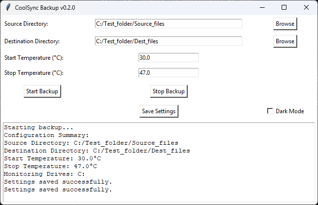
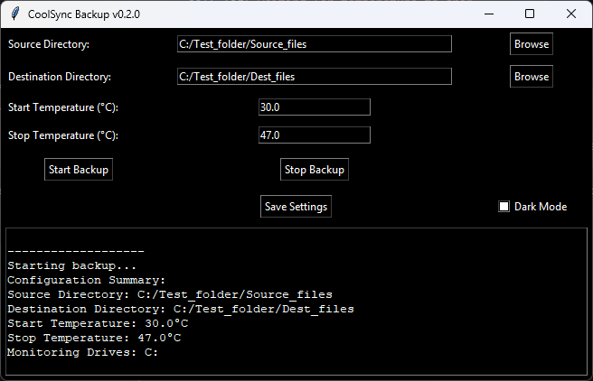

# CoolSync Backup

## Version 0.2.5 (started from scratch)

### Changelist for v0.2.5:
- **Added `stop_sync` method**: Ensures the synchronization process can be stopped properly.
- **Included `on_closing` method**: Handles window close events cleanly.
- **Updated temperature display logic**: Ensures temperatures are read and displayed accurately.
- **Implemented thread joining**: Guarantees the synchronization thread is properly joined and cleaned up.
- **Detect multiple storage device types**: Enhances the ability to monitor temperatures of various devices.
- **Removed outdated `config.ini` files**: Updated to use `config.json` for configuration.
- **Added `.gitignore` updates**: Ensures unnecessary files are not tracked by Git.

### Known issues:
- Pressing Sync and Stop may stop responding eventually.
- Temps may be inaccurate on some storage devices.

## Version 0.2.0

### Light Mode


### Dark Mode


## Features
- Added dark mode toggle feature.
- Ensured settings are saved and loaded correctly upon relaunch.
- Fixed bugs and improved UI.

## Instructions
1. Download and extract the project files.
2. Run the `CoolSyncBackup_GUI_v0.2.0.py` script.
3. Use the GUI to set source and destination directories.
4. Toggle dark mode if desired.
5. Start and stop backups as needed.

## Usage
Run the application:
```bash
python CoolSyncBackup_GUI_v0.2.0.py

Ensure you have the required dependencies installed:
bash
pip install -r requirements.txt
Overview
CoolSync Backup is a streamlined synchronization tool designed for efficiency and simplicity. This repository now focuses on the console version, with plans to eventually incorporate improvements into a new GUI version.
Current Versions
Console Version
The console version, console/CoolSyncBackup_console_v0.1.0.py, is designed to be straightforward and requires no additional configuration files.
Future Plans
We will be building and expanding upon this console version, including potential future GUI updates based on this refined code.
Installation
1. Clone the repository:
bash
git clone https://github.com/ConceptExplorer/CoolSync-Backup.git
License
This project is licensed under the Creative Commons Attribution-ShareAlike 4.0 International License - see the LICENSE file for details.
Disclaimer
CoolSync Backup is provided "as is", without warranty of any kind, express or implied, including but not limited to the warranties of merchantability, fitness for a particular purpose, and noninfringement. In no event shall the authors or copyright holders be liable for any claim, damages, or other liability, whether in an action of contract, tort, or otherwise, arising from, out of, or in connection with the software or the use or other dealings in the software.
Important:
* Use at your own risk.
* The authors are not responsible for any loss of data or damage to your system.
* It is recommended to run the software in a sandbox or virtual machine if you do not fully understand the code.
* This is an early release and may contain bugs.
For full license details, see the LICENSE file.
About This Project
This project was developed with the assistance of Microsoft Co-Pilot, an advanced AI companion designed to enhance productivity and creativity. Special thanks to Co-Pilot for its invaluable support in bringing CoolSync Backup to life!

